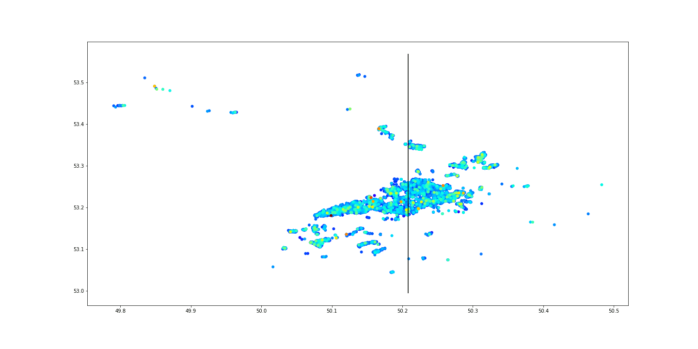

# real_estate_samara

The logic of all the files is practically the same. There are 2 basic purposes:

1. To find the most undervalued flats (currently on sale).
2. To estimate the price of one particular flat (e.g., your flat).

Somehow, the details vary a bit:
1. domofond_flats_mixed.ipynb
The code takes ALL recent real estate ads from domofond.ru (Samara).
2. domofond_new_flats.ipynb
The code takes ONLY NEW recent real estate ads from domofond.ru (Samara).
3. domofond_resale_flats.ipynb
The code takes ONLY SECONDARY housing market  recent real estate ads from domofond.ru (Samara).
4. domofond_flats_amount_depend.ipynb
The code tries to understand, how much ads do we need to build a proper model.

The ML algotithm tries to match the existing prices and the locations of the flats. Though the model is very simple, it explains more than 80% of the flats price.

RandomForest process:
 

Linear regression:

